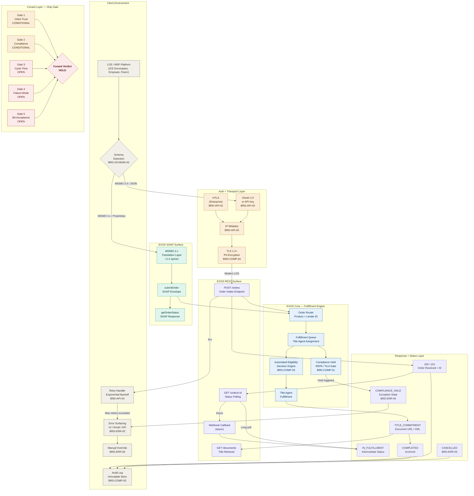

# EXOS Title Pull System — API Architecture Brief
**Regulated FinServ Presales Framework | Conard Layer Active**
*Erwin Maurice McDonald | Epoch Frameworks LLC | DACR License v2.6 | June 2026*

---

## What This Document Is

This brief translates the ServiceLink API BRD discovery data into an architecture reference document for developers, BA leads, and mortgage technology executives. It covers the dual-surface API architecture (REST + SOAP), the schema layers that govern every title pull, the Conard Layer gate status, and the blocking work required before API testing can be scheduled.

---

## Architecture Overview — The Two API Surfaces

EXOS Close is ServiceLink's closing and title fulfillment platform. When a lender integrates via API, EXOS becomes the order intake, status management, and fulfillment orchestration layer. The client system never touches the title directly — it submits an order object to EXOS, EXOS routes to the correct title agent or fulfillment queue, and status updates flow back.

Two distinct API surfaces exist and both must be understood:

| Surface | Protocol | Use Case | Schema Standard |
|---------|----------|----------|-----------------|
| **REST** | HTTP / JSON | Order intake, status polling, webhooks, document retrieval | MISMO 3.4, JSON payload |
| **SOAP** | XML envelope | Legacy LOS platforms, MISMO 2.x translation, title commitment data | MISMO 2.x / 3.4, XML |

The decision between REST and SOAP is determined at Phase B (BRD-SCHEMA-02) of the discovery guide. Most modern integrations target REST. SOAP is required when the client LOS outputs MISMO 2.x or a proprietary schema that cannot map to JSON without a translation layer.

---

## System Architecture Diagram



---

## REST API Layer — Order Intake and Status

### What REST Handles

The REST surface is the primary integration path for modern LOS platforms on MISMO 3.4.

| Step | Action | BRD Field |
|------|--------|-----------|
| 1 | Client LOS sends order initiation payload via `HTTP POST` to EXOS order intake endpoint | BRD-SCOPE-02 |
| 2 | EXOS returns an order ID and `200/201` acknowledgement, or a validation error (`4xx`) | BRD-SCHEMA-06 |
| 3 | Client polls order status via `GET` using the order ID, or receives webhook callbacks if configured | BRD-ERR-02 |
| 4 | Completed title data is returned in the status payload or via a separate document retrieval endpoint | BRD-SCOPE-01 |

### Auth and Transport

| Component | Spec | BRD Field |
|-----------|------|-----------|
| Auth pattern | OAuth 2.0 client credentials or API key. mTLS available for enterprise — requires cert provisioning lead time | BRD-API-02 |
| Transport | TLS 1.2 minimum. PII fields (SSN, full DOB, borrower name) must be encrypted in payload — never in query parameters | BRD-COMP-04 |
| IP whitelist | Client IP range must be submitted to ServiceLink API ops before sprint 1. Most common day-one blocker | BRD-API-03 |
| Rate limits | Calls per minute / hour / day must be confirmed. Retry logic must use exponential backoff | BRD-API-04 |

---

## SOAP API Layer — Legacy Schema and MISMO Translation

### Why SOAP Exists

The title industry runs heavily on MISMO 2.x schemas inherited from legacy LOS platforms. EXOS maintains a SOAP interface to:

- Accept MISMO-formatted order objects from older LOS platforms that cannot output JSON
- Return title commitment data, search results, and exception states in MISMO-compliant XML envelopes
- Support clients with proprietary schemas via a translation layer that maps non-standard fields to EXOS-accepted values

### REST vs SOAP Decision Matrix

| Source Schema | Integration Path | Sprint Impact |
|---------------|------------------|---------------|
| MISMO 3.4 | REST with JSON payload — modern Encompass, newer MSP builds | Standard |
| MISMO 2.x | SOAP directly, or REST with translation layer | +1 to 2 sprints |
| Proprietary | REST with custom translation layer — BRD-SCHEMA-03 required | +1 to 2 sprints |
| Mixed (2.x + 3.4) | Both surfaces may be in scope simultaneously | Scoped per product line |

---

## Schema Layers — What the Title Pull Contains

### Order Intake Payload — Mandatory Fields (BRD-SCHEMA-04)

> Every mandatory field gap is a guaranteed test failure. Map all fields before sprint 1.

**Primary object anchors:**

| Field Group | Fields | Compliance Note |
|-------------|--------|-----------------|
| Loan identifiers | Loan number, product type, transaction type (purchase / refi) | Routes fulfillment in EXOS |
| Property | APN, legal description, county, state, property type | Required for title search |
| Borrower | Name, SSN (encrypted), address | RESPA-governed — PII in transit rules apply |
| Lender | Lender ID, loan amount, closing date | Drives agent assignment and fee schedule |

**Schema risk fields:**

| BRD Field | Risk | Required Action |
|-----------|------|-----------------|
| BRD-SCHEMA-03: Custom fields | Fields not in EXOS schema will fail silently or 4xx | Designate each as pass-through, dropped, or errored before sprint 1 |
| BRD-SCHEMA-05: Null handling | Null required field behavior is undefined until tested | Test both null-returns-4xx and null-drops-field paths in sandbox |

### Title Pull Response Payload — Status Code Map (BRD-SCHEMA-06)

> Every EXOS status code must have a named client-side action. No unmapped codes at go-live.

| Status Code | Meaning | Client-Side Action Required |
|-------------|---------|----------------------------|
| `200 / 201` | Order received + ID issued | Create order tracking record in LOS |
| `IN_FULFILLMENT` | Routed to title agent, processing | Do not timeout — use async polling or webhook |
| `COMPLIANCE_HOLD` | RESPA / TILA hold or title defect | Trigger manual review workflow; BRD-ERR-04 recipient must be named |
| `TITLE_COMMITMENT` | Title data available | Retrieve document via REST doc endpoint; trigger closing workflow |
| `COMPLETED` | Order closed and archived | Write final status to LOS; close audit record |
| `CANCELLED` | Order voided | Execute BRD-ERR-05 rollback logic; update audit log |
| `4xx` | Validation or auth failure | Execute BRD-ERR-01 retry with backoff; surface error per BRD-ERR-03 |
| `5xx` | EXOS server error | Escalate to manual per BRD-ERR-02 timeout threshold |

---

## Compliance and Regulatory Layer

| BRD Field | Requirement | Status |
|-----------|-------------|--------|
| BRD-COMP-01: RESPA scope | Section 8 applies to most title referral workflows. Legal must confirm scope before sprint 1 | Required |
| BRD-COMP-02: Audit retention | Immutable logs. Retention period, format, and storage location must be in BRD before dev writes the API call handler | Required |
| BRD-COMP-03: Model governance | Required if EXOS automated eligibility decision is in scope. Freddie Mac March 2026 requirements apply | Conditional |
| BRD-COMP-04: PII handling | TLS 1.2+ minimum. Field-level encryption required if SSN or full DOB is in payload | Required |
| BRD-COMP-05: SLA regulatory floor | TILA, RESPA, and state law may impose turnaround SLAs. Dev must be aware of compliance ceiling | Required |

---

## Conard Layer Gate Status

> The Conard Layer governs whether API testing can be scheduled. A HOLD verdict means no test sprint can begin.

| Gate | Status | Blocking Issue |
|------|--------|----------------|
| 1 — Client Trust | `CONDITIONAL` | BRD-SCHEMA-06 status code map must be complete. Exception handling and decision timing not yet documented |
| 2 — Compliance | `CONDITIONAL` | BRD-COMP-01 (RESPA scope) and BRD-COMP-04 (PII handling) required. Model governance required if EXOS automated eligibility is in scope |
| 3 — Cycle-Time | `OPEN` | Client must confirm baseline order placement time and target post-integration time. If unquantifiable, name an owner before UAT |
| 4 — Failure-Mode | `OPEN` | All six Phase E fields must be populated: 4xx handling, timeout threshold, error surfacing, compliance hold recipient, cancellation/rollback, manual override |
| 5 — BA Acceptance | `OPEN` | All six Phase F fields must be populated and signed: sandbox success criteria, credential confirmation, test data type, UAT promotion gate, UAT sign-off owner, parallel run period |

### Conard Verdict

```
Conard Layer Verdict:  HOLD

Why: Three gates are open and API testing cannot be scheduled until Phase E
     (error handling) and Phase F (acceptance criteria) are fully documented
     and signed.

Evidence:
  - Client Trust:    CONDITIONAL — status code map incomplete
  - Compliance:      CONDITIONAL — RESPA scope and PII handling fields pending
  - Cycle-Time:      OPEN — baseline and target cycle times not confirmed
  - Failure-Mode:    OPEN — Phase E discovery not completed
  - BA Acceptance:   OPEN — Phase F acceptance criteria not signed

Open Risks:
  - IP whitelist request not confirmed submitted (day-one blocker)
  - MISMO schema version not yet confirmed (affects REST vs SOAP routing decision)
  - Compliance hold recipient unnamed (RESPA gap)
  - Cancellation endpoint not documented (RESPA requirement)

Next Gate:  Complete Phase E and Phase F discovery with client. Re-run Conard
            gates. Minimum target: SHIP WITH CONTROLS with named controls,
            owners, and follow-up gate documented before sprint 1 kickoff.
```

---

## What Must Happen Before Sprint 1

| Priority | Action | Owner | BRD Field |
|----------|--------|-------|-----------|
| 1 | Submit IP whitelist request to ServiceLink API ops | Dev lead | BRD-API-03 |
| 2 | Confirm MISMO schema version from client LOS | BA | BRD-SCHEMA-02 |
| 3 | Complete Phase E error handling discovery with client | BA | BRD-ERR-01 through 06 |
| 4 | Complete Phase F testing acceptance criteria with client | BA + Dev lead | BRD-TEST-01 through 06 |
| 5 | Confirm sandbox credentials received | Dev lead | BRD-TEST-02 |
| 6 | Re-run Conard gates and issue updated verdict | BA | Section 3 |
| 7 | No API testing scheduled until SHIP or SHIP WITH CONTROLS verdict issued | PM | Conard Layer |

---

## Document Provenance

**Frameworks applied:**
- Regulated FinServ Presales Framework — Conard Layer mortgage / title API shipping gate (McDonald, 2026)
- Source repository: [emcdo411/api-client-intelligence](https://github.com/emcdo411/api-client-intelligence/blob/main/Outputs/service-link-api-brd.md)

**McDonald, E.M. (2026).** EXOS Title Pull System — API Architecture Brief. Epoch Frameworks LLC. DACR License v2.6. Fort Worth, TX.

---

*This document is a BA working artifact. It does not constitute legal, compliance, or financial advice. Compliance determinations must be reviewed by qualified legal counsel before sprint execution. No API testing should be scheduled before a Conard Layer SHIP or SHIP WITH CONTROLS verdict is issued and documented.*
